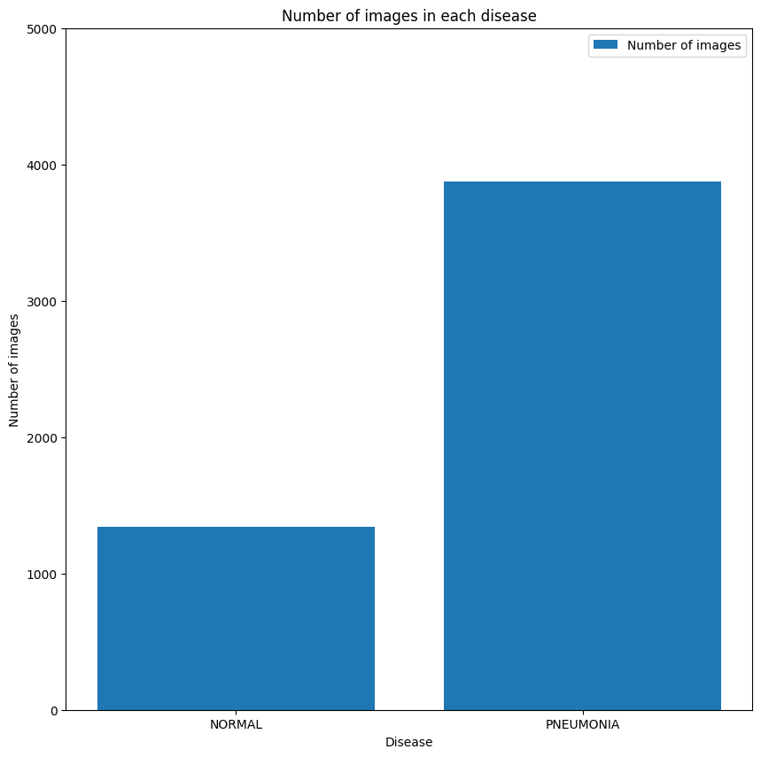
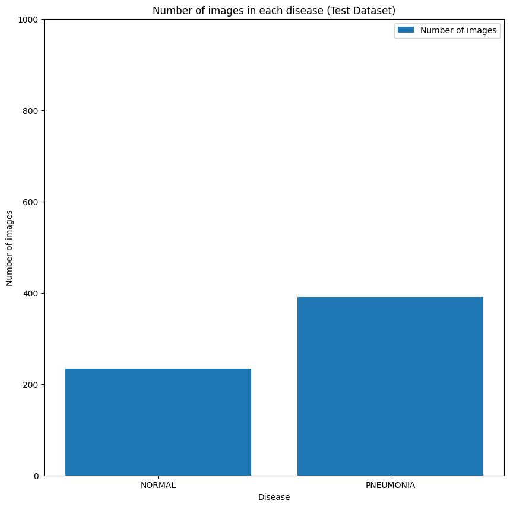

# **Pneumonia X-ray Classifier**

## **Overview**
This project is a deep learning-based **binary classification model** that detects pneumonia from chest X-ray images. It aims to assist in automating pneumonia diagnosis by leveraging convolutional neural networks (CNNs).


Pneumonia - Yes

## **Features**
✅ **Trained on labeled chest X-ray images**  
✅ **Three different models for precision, recall, and balanced performance**  
✅ **Achieves ~88% accuracy**  
✅ **Built using Xception architecture**  
✅ **Preprocessed images and applied data augmentation**  

## **Model Details**
I created three variations of the classifier:
1. **High Recall Model** → Prioritizes identifying pneumonia cases (minimizing false negatives)  
2. **High Precision Model** → Reduces false positives but might miss some pneumonia cases  
3. **Balanced Model** → Optimized for overall accuracy and F1-score  
<h5>&nbsp;&nbsp;&nbsp; At last i merged all three models in a single model</h5> 

## **Dataset**
- The dataset consists of 5000 **chest X-ray images** labeled as **Pneumonia** or **Normal**.
- Images were resized and normalized for deep learning processing.
- Augmentation techniques were used to enhance model generalization.




## **Implementation**
- **Framework:** TensorFlow/Keras  
- **Model Architecture:** Xception (Conv_base) + Dense Layers  
- **Loss Function:** Binary Cross-Entropy  
- **Optimizer:** Adam  
- **Evaluation Metrics:** Accuracy, Precision, Recall, F1-score  

## **Installation & Usage**
### **1. Clone the Repository**
```bash
git clone https://github.com/RajatJain2003visual/PneumoniaClassifier.git
cd PneumoniaClassifier
```
### **2. Install Dependencies**
```bash
pip install -r requirements.txt
```
### **3. Run the Model**
Due to GitHub's file size limit, the model is hosted on Google Drive.  
Click the button below to download the model:

<a href="https://drive.google.com/file/d/1-1CdiupyRAFvblfqZxc2D8ww3UHieKbV/view?usp=drive_link" target="_blank">
  
</a>  
<br>
<br>

IPYNB Project File :  
 [](https://colab.research.google.com/drive/1e4pbpFQLkKrQt0lG-ltCDBnjYLsBWZmz?usp=sharing)


```python
python predict.py --image_path sample_xray.jpg  # To make a prediction
```

## **Results & Performance**

| Model | Accuracy | Precision | Recall | F1-Score |
|--------|----------|----------|---------|---------|
| pneumoniaClassifier | 88.94% | 86.90% | 96.92% | 90.22% |


## **Future Improvements**
🔹 Hyperparameter tuning (currently not used due to computational cost)  
🔹 Experimenting with different architectures (e.g., ResNet, EfficientNet)  

## **Contributors**
👤 **Rajat Jain** – *Developer*  
